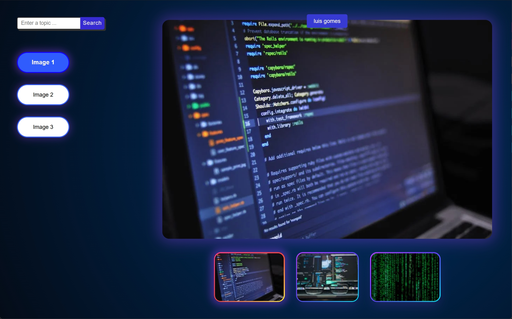

# Pexels layout 
(Photo Gallery Application)

This project is a responsive photo gallery application developed as an exercise to demonstrate front-end development skills using React.js. The application dynamically fetches images from the Pexels API and provides an intuitive interface to explore images based on various search topics.

---

## Screenshots



---
## Approach to Development

- At first, I used **Postman** to test the provided API and examine the response. After understanding the API's structure, I began building the base functionality of the application. Once the functionality was in place, I focused on designing the UI.
- Initially, I created a basic design, which I gradually enhanced to be more comprehensive and visually appealing.
- This phase took more time as I frequently experimented with different styles and kept revising how I wanted the app to look. Finally, I worked on making the app responsive for various screen sizes.

---

## What I Would Improve

- Due to time constraints and the project deadline, I rushed the CSS development by styling each component individually. Ideally, I would prefer to create a base CSS for the overall application first, then customize specific styles for individual components as needed.

- This approach would also allow me to use CSS variables for colors, fonts, and sizes, ensuring consistency across the UI and simplifying responsiveness. With variables for font weights, sizes, and colors, managing the design and making changes would be much easier.However, due to the frequent style revisions I made during the project, I had to rush through the CSS, which resulted in some inconsistencies.

- I would also implement an input feature that allows users to specify the number of pictures they want. This would enhance user customization and improve the overall experience.

- Additionally, a toast message for empty search inputs would help inform users to provide a valid query, enhancing user feedback and experience.

---

## Deployment

- The application has been deployed on a server for demonstration purposes and is currently accessible at [alipeiro.xyz](https://alipeiro.xyz). Since this deployment is only for showcase, it is hosted on my Raspberry Pi and will not remain live for an extended period.

---
## Features

### Layout
- **Left Rail**: A vertical panel containing buttons (e.g., "Image 1", "Image 2", etc.) to select an image.
- **Main Area**:
  - Displays the currently selected image.
  - Shows the photographer's name as a link above the main image.
  - Thumbnails of all images below the main image for easy navigation.
- **Responsive Design**: Ensures the layout adapts to various screen sizes, including desktops, tablets, and mobile devices.

### Functionality
- Clicking a button in the left rail or a thumbnail updates the main image and highlights the corresponding button and thumbnail.
- Dynamically fetches images using the Pexels API based on a search topic.
- Allows users to search for images by entering a topic in the search bar.

### Data Retrieval
- Images are fetched from the [Pexels API](https://www.pexels.com/api/) using the following example request:
  ```bash
  curl -H "Authorization: YOUR_API_KEY" \
  "https://api.pexels.com/v1/search?query=nature&per_page=3"
  ```
- The default search topic is **nature**.

---

## Technologies Used

- **React.js**: For building the user interface.
- **CSS**: For styling, including responsiveness with `@media` queries.
- **Pexels API**: For fetching image data dynamically.

---

## Directory Structure

```
.gitignore
package.json
public/
    index.html
    manifest.json
    robots.txt
README.md
src/
    App.css
    App.js
    components/
        Image/
            mainImage.css
            MainImage.js
        Rail/
            rail.css
            Rail.js
        Search/
            searchbar.css
            Searchbar.js
        Thumbnail/
            thumbnail.css
            Thumbnail.js
    index.css
    index.js
```

---

## Components

### App.js
- The root component that manages the state of images and search topics.

### Rail
- Displays the left-side rail with buttons to select images.

### MainImage
- Displays the currently selected image with the photographer's information.

### Thumbnail
- Displays thumbnails of all images for quick navigation.

### SearchBar
- Allows users to input a topic and search for relevant images.

---

## Responsiveness

- Breakpoints are added for mobile and desktop devices as well as smaller screens.
- Styles adapt the layout, images, and text to ensure usability on all screen sizes.

---

## Installation

1. Clone the repository:
   ```bash
   git clone https://github.com/4lipeiro/digit-exercise
   ```
2. Navigate to the project directory:
   ```bash
   cd digit-exercise
   ```
3. Install dependencies:
   ```bash
   npm install
   ```
4. Start the development server:
   ```bash
   npm start
   ```
5. Open the application in your browser at `http://localhost:3000`.

---

## Usage

1. Launch the application.
2. Use the **Search Bar** to search for images by topic.
3. Click buttons in the left rail or thumbnails to view the corresponding image.
4. Click the photographer's name to visit their Pexels profile.

---

## Author

Developed by Ali Peiro.
